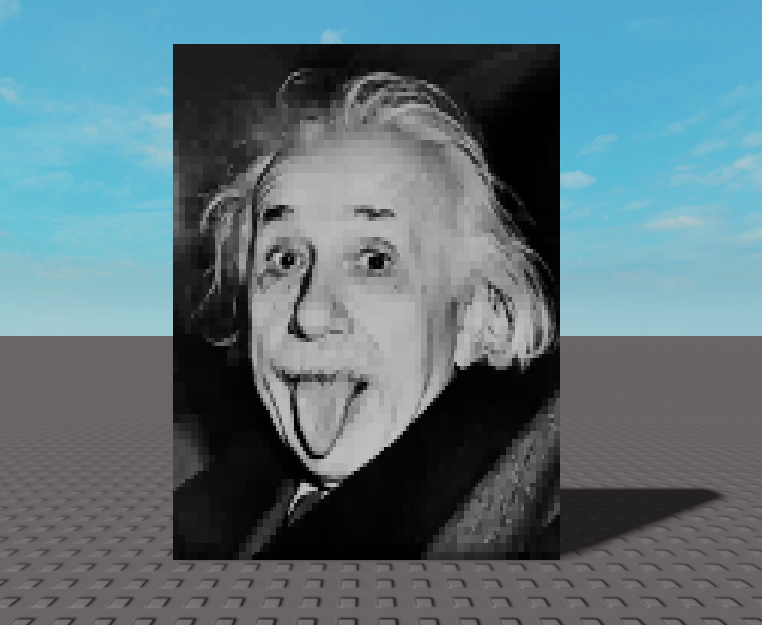
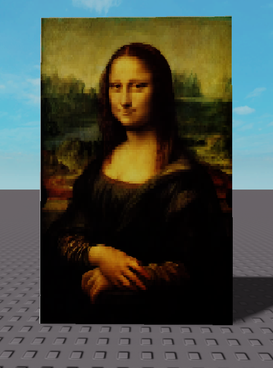
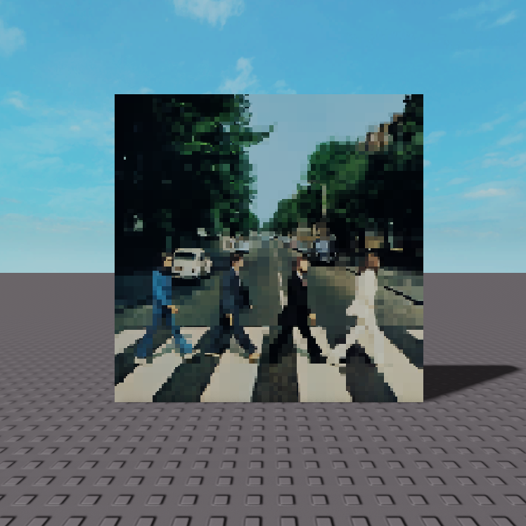
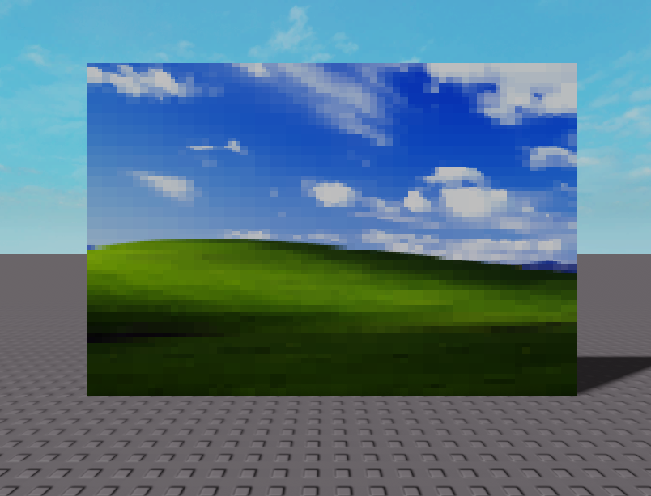
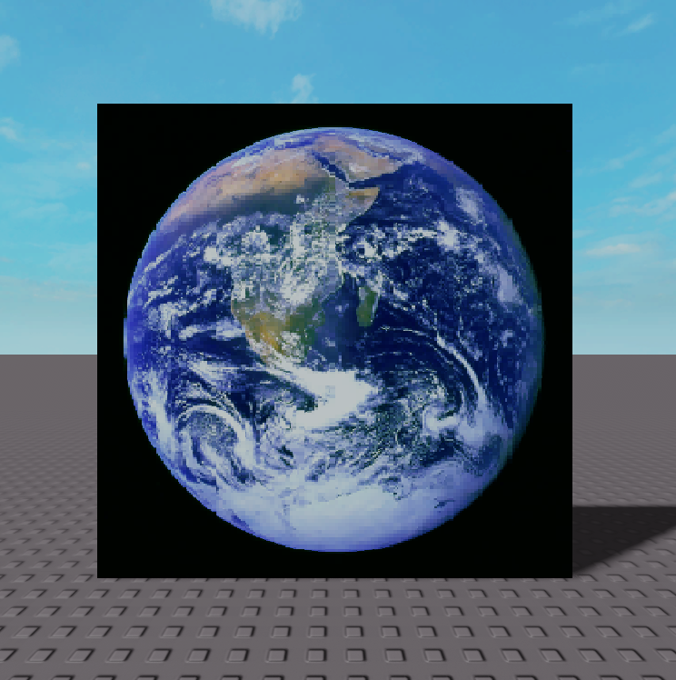

# roblox image bypasser

a website that lets you bypass roblox's image moderation system by manually reconstructing an image using individual pixels, or blocks. many other similar tools that do this exist, but this one is different, as it uses [rectangle packing](https://en.wikipedia.org/wiki/Rectangle_packing) to reconstruct the image inside of roblox, which heavily reduces the amount of pixels needed and greatly increases performance in-game.

you can use it at [https://infinixi.us/robloximagebypasser](https://infinixi.us/robloximagebypasser)!

please note this is purely for educational and research purposes, and i am not responsible for any misuse of this website. the source code is under the [MIT License](https://github.com/Infinixius/robloximagebypasser/blob/main/LICENSE), meaning you can do whatever with it.

## example photos

